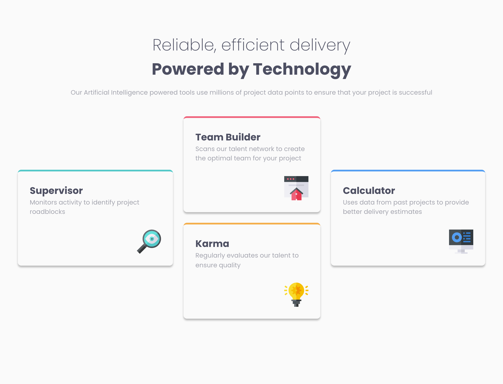
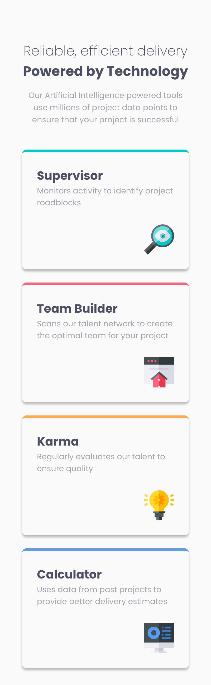

# Frontend Mentor - Four card feature section solution

This is a solution to the [Four card feature section challenge on Frontend Mentor](https://www.frontendmentor.io/challenges/four-card-feature-section-weK1eFYK). Frontend Mentor challenges help you improve your coding skills by building realistic projects. 

## Table of contents

- [Overview](#overview)
  - [The challenge](#the-challenge)
  - [Screenshot](#screenshot)
  - [Links](#links)
- [My process](#my-process)
  - [Built with](#built-with)
  - [What I learned](#what-i-learned)
- [Author](#author)

## Overview

### The challenge

Users should be able to:

- View the optimal layout for the site depending on their device's screen size

### Screenshot

#### Desktop View



#### Mobile View




### Links

- Solution URL: [Add solution URL here](https://github.com/fvdumaa/four-card-feature)
- Live Site URL: [Add live site URL here](https://fvdumaa.github.io/four-card-feature/)

## My process

### Built with

- Semantic HTML5 markup
- CSS custom properties
- Flexbox
- CSS Grid
- Mobile-first workflow

### What I learned

I learnt how to apply CSS grid with template areas, however still slightly confused with rows and columns and fr values which I will try and apply to next project if possible

```css
   section + section {
        display: grid;
        grid-template-areas: 
        ". team-builder ."
        "supervisor team-builder calculator"
        "supervisor karma calculator"
        ". karma ." ;
    }
    article:nth-of-type(2) { grid-area: team-builder;}
    article:nth-of-type(1) { grid-area: supervisor;}
    article:nth-of-type(3) { grid-area: karma;}
    article:nth-of-type(4) { grid-area: calculator;}

 
```

## Author

- Website - [fvdumaa](https://github.com/fvdumaa)

